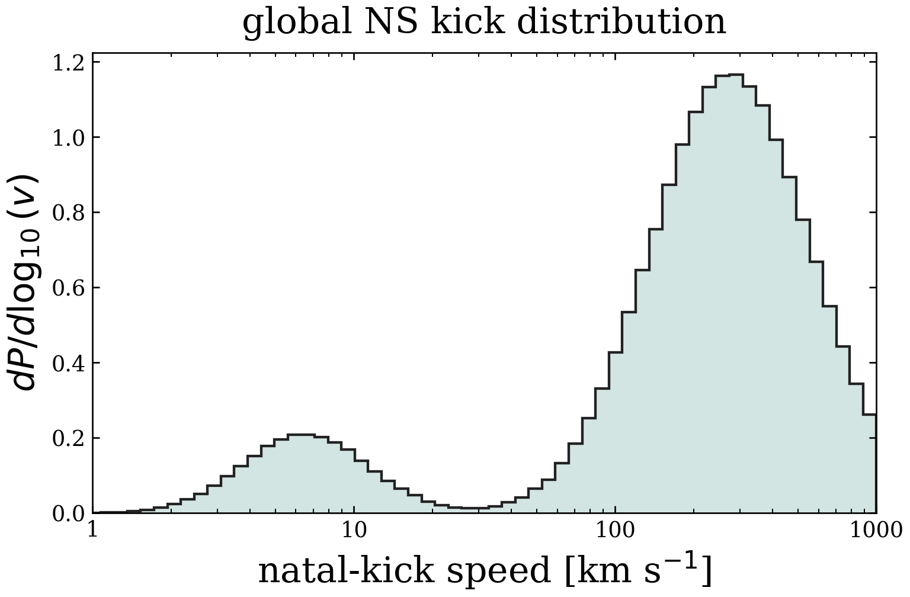

# NS kick sampler

A simple NumPy function for sampling neutron-star natal-kick speeds from the global NS kick distribution inferred in *A concordance model of neutron star kicks* by Cheyanne Shariat, Kareem El-Badry, and Smadar Naoz.

## Use

```bash
git clone https://github.com/cheyanneshariat/ns-kick-sampler.git
cd ns-kick-sampler
python -m pip install numpy
```

```python
from ns_kick_sampler import sample_kick_speeds

speeds_kms = sample_kick_speeds(10_000, seed=67)
```

`seed` is passed to `numpy.random.default_rng`. The function returns a 1D NumPy array; `n=0` returns an empty array.

## Conventions and provenance

The model first chooses a component with global all-NS-birth low-kick fraction

```text
f_low = 0.126
```

and then samples a scalar speed from

```text
low:  ln(v / (km/s)) ~ Normal(mean=1.87, std=0.55)
high: ln(v / (km/s)) ~ Normal(mean=5.62, std=0.71)
```

Each component is separately normalized and truncated to `0.05 < v / (km/s) < 1000`. 

The sampler uses the posterior medians reported in Table 2 of our paper. The high-velocity component is constrained by the young-pulsar distribution of [Disberg & Mandel (2025)](https://arxiv.org/abs/2505.22102). It samples kick speeds at fixed parameter values.

For 3D kick vectors with isotropic directions:

```python
from ns_kick_sampler import sample_kick_vectors

kicks_kms = sample_kick_vectors(10_000, seed=67)
```

The result has shape `(n, 3)`, with columns `(vx, vy, vz)` in km/s in any chosen orthonormal frame. Vector magnitudes follow the same kick-speed distribution.



Histogram of 1,000,000 sampled speeds (`seed=67`), showing probability density per decade in speed.

To regenerate the PNG:

```bash
python3 -m pip install matplotlib
python3 plot_kick_distribution.py
```

## License

MIT
